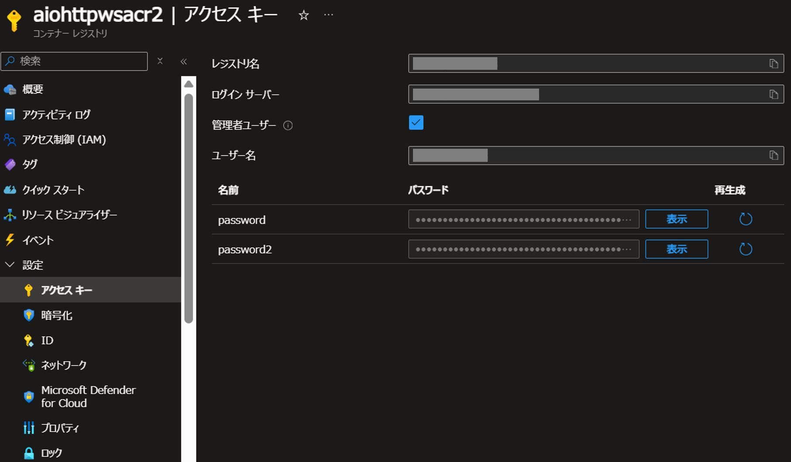
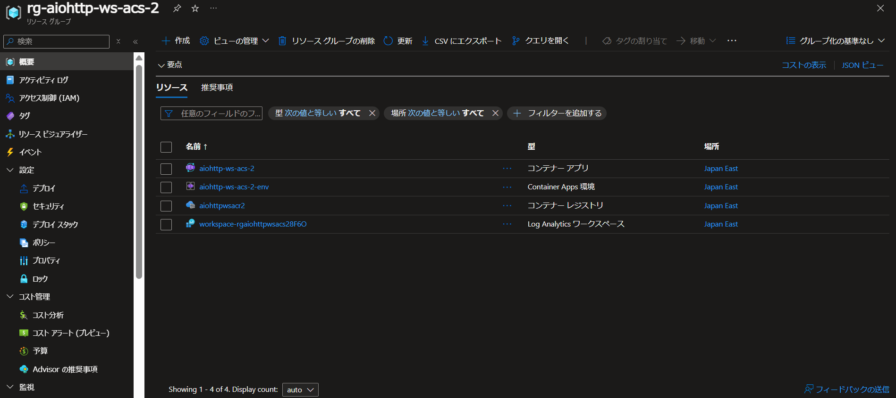

# client
aiohttp を使った websocket の Client サンプルです。

## ローカルでの実行

### 前提条件
以下を前提とします。
- Docker がインストール済み

### 実行手順
コンテナイメージの作成
```
docker build -t websocket-client .
```

コンテナの実行
```
docker run websocket-client --host-ip $(hostname -I | awk '{print $1}')
```

ローカルで実行するための Client 側の手順は以上です。

## Azure での実行

### 前提条件
以下を前提とします。
- Docker がインストール済み
- Azure CLI がインストール済み

### 実行手順
Azure でコンテナを実行する 1 つの方法として、Azure Container Apps へのデプロイがあります。

リソースグループの作成
```
az group create --name <リソースグループ名> --location japaneast
```

コンテナイメージの保存用 Azure Container Registry の作成
```
az acr create --resource-group <リソースグループ名> --name <Azure Container Registry 名> --sku Basic
```

コンテナイメージの作成
```
docker build -t websocket-client .
```

Azure Container Registry へのログイン (※)
```
docker login <Azure Container Registry 名>.azurecr.io
```

※ ユーザー名とパスワードは、Azure ポータルの Azure Container Registry のリソース画面 > 設定 > アクセスキーから確認可能


デプロイするコンテナイメージのタグ付け
```
docker tag websocket-client:latest <Azure Container Registry 名>.azurecr.io/websocket-client:latest
```

Azure Container Registry へのプッシュ
```
docker push <Azure Container Registry 名>.azurecr.io/websocket-client:latest
```

Azure Container Apps の作成とコンテナのデプロイ
```
az containerapp create --name <Azure Container Apps 名> --resource-group <リソースグループ名> --args="--address=<Azure Container Apps にデプロイされている Server のドメイン名>:80" --environment '<Azure Container Apps 名>-2-env' --image <Azure Container Registry 名>.azurecr.io/websocket-client:latest --ingress external --min-replicas 1 --registry-server <Azure Container Registry 名>.azurecr.io --registry-username <ユーザー名> --registry-password <パスワード名>
```

### 補足
Azure CLI で az containerapp コマンドを実行するときにパラメーターの不足に関するエラーが表示される場合は以下のコマンドを実行してください。

-最新バージョンの Azure Container Apps 拡張機能をインストール
```
az extension add --name containerapp --upgrade
```

### スクリーンショット
Azure へのデプロイ完了後、Azure ポータルでは次のようなリソースが作成されます。


## 参考文献
- https://learn.microsoft.com/ja-jp/azure/container-apps/get-started?tabs=bash
- https://learn.microsoft.com/ja-jp/cli/azure/acr?view=azure-cli-latest#az-acr-login
- https://learn.microsoft.com/ja-jp/cli/azure/containerapp?view=azure-cli-latest#az-containerapp-create
- https://techcommunity.microsoft.com/t5/apps-on-azure-blog/command-override-in-azure-container-apps-container-app-job/ba-p/4082514
